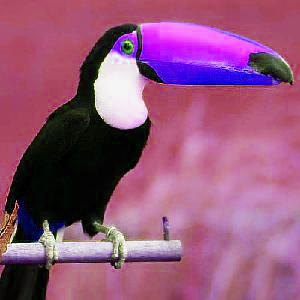

# 1-4 Performace Task
### Client 4: Developer

## Goal
A main script (run from terminal) processes an image with a library of image tools. Run would look something like `$ _name_of_project_ imagefile.jpg|png _function_to_apply_` which would display a window showing the original image side by side with the applied image.

### Tools to start out with
* Grayscale Coloring 
* Circle/polygon Packing
* Thermal Coloring
* Number Visualization (colored mosaic)

### Conventions
All transformation tools are located somewhere in the tools package, and can all be called on from the root of the package. To follow the zen of python package structure: the less dots the better.

### Egan's Tasks
* [ ] Polygon Packing
	* Function Name: `poly(image)`
* [ ] Grayscale Coloring
	* Function Name: `gray(image)`
* [ ] Thermal Coloring
	* Function Name: `thermal(image)`

### Miles's Tasks
* [x] Create Package Structure
* [x] main.py file
	1. [x] Takes user input (image file, tool to apply)
	1. [x] Displays output of applied tool
* [x] Blur
	* Function name: `blur(image)`
	* Original vs Blur:
		
		 
* [x] Color Shifting
	* Function name: `shift(image)`
	* Shift RGB values one to the left (Red values become Blue, Green becomes Red, Blue becomes Green), or right.
	* Original vs Shift vs LShift:

		 
		
